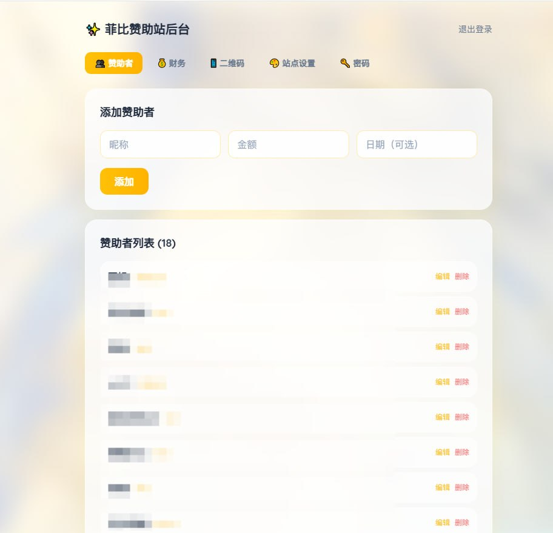
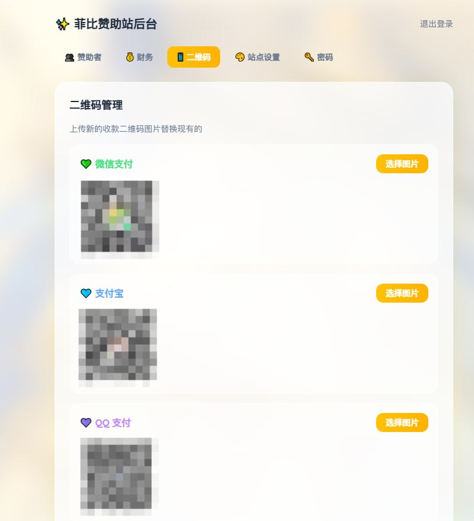

# zz.fb520.site - 赞助菲比 Bot 官网

鸣潮免费分享机器人「菲比 Bot」的赞助页面。

## 功能

- 💛 赞助者名单展示（自动统计收入）
- 📊 运营财务概览（收入/支出/盈亏）
- 💚💙💜 微信/支付宝/QQ 三种支付方式
- 🔐 后台管理（密码保护，首次设置）
- 📱 后台上传替换二维码图片
- 🎨 后台编辑站点标题、描述、头像、背景
- 🔑 密码哈希存储，代码可公开

## 技术栈

- **前端**: HTML + Tailwind CSS + 原生 JS
- **后端**: Flask + werkzeug.security
- **部署**: systemd + OpenResty 反代

## 目录结构

```
├── app.py              # Flask API 后端（无明文密码）
├── index.html          # 主页（动态加载配置）
├── admin.html          # 后台管理面板
├── assets/             # 静态资源（二维码、头像、背景）
│   ├── wechat.jpg
│   ├── alipay.jpg
│   ├── qq.jpg
│   ├── phoebe-avatar.jpg
│   └── bg-phoebe.jpg
└── data/               # 数据目录（不入仓库）
    ├── sponsors.json
    ├── finance.json
    └── config.json
```

## API 接口

| 方法 | 路径 | 说明 | 需要认证 |
|------|------|------|----------|
| GET | /api/password/status | 检查是否已设密码 | ❌ |
| POST | /api/password/setup | 首次设置密码 | ❌ |
| POST | /api/password/change | 修改密码 | ✅ |
| GET | /api/config | 获取站点配置 | ❌ |
| PUT | /api/config | 更新站点配置 | ✅ |
| GET | /api/sponsors | 获取赞助者列表 | ❌ |
| POST | /api/sponsors | 添加赞助者 | ✅ |
| PUT | /api/sponsors/:id | 编辑赞助者 | ✅ |
| DELETE | /api/sponsors/:id | 删除赞助者 | ✅ |
| GET | /api/finance | 获取财务数据 | ❌ |
| PUT | /api/finance | 更新财务数据 | ✅ |
| POST | /api/upload/qr/:type | 上传二维码 | ✅ |
| POST | /api/upload/image/:type | 上传头像/背景 | ✅ |

认证方式：请求头 `X-Admin-Password: <密码>`

## 部署

```bash
# 后端
cp app.py /opt/zz-sponsor-api/app.py
sudo systemctl restart zz-sponsor-api

# 前端
cp index.html admin.html /opt/1panel/www/sites/zz.fb520.site/index/
```

## 效果预览

### 后台管理 - 赞助者列表


### 后台管理 - 财务概览


### 后台管理 - 二维码上传


### 后台管理 - 站点设置


### 后台管理 - 密码修改


## License

MIT
